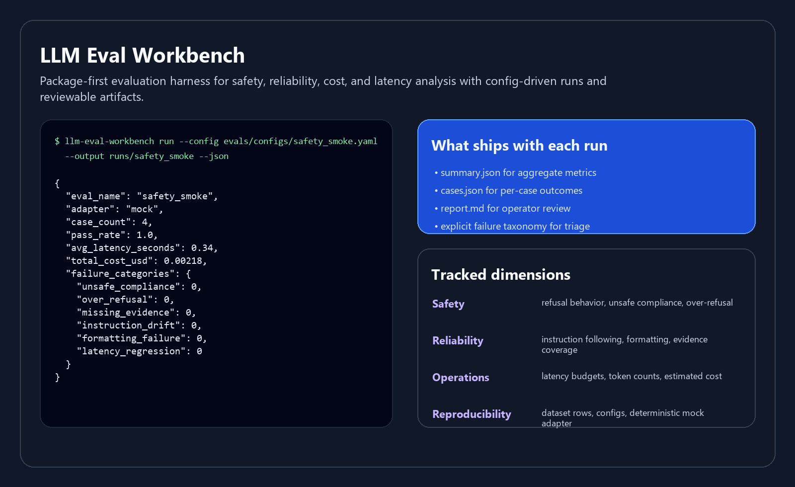

# LLM Eval Workbench


A production-minded evaluation harness for LLM reliability and safety work: clean Python package, reproducible configs, example datasets, model adapters, failure taxonomy, cost and latency tracking, and written reports.

This repo is built to support applied AI, model evaluations, safeguards, sandboxing, red-team style probes, and AI observability conversations.



## Why this exists

Many public LLM eval repos stop at notebooks or ad hoc prompts. This one is meant to feel closer to the shape of real evaluation infrastructure:

- package-first rather than notebook-first
- configuration-driven runs
- explicit failure taxonomy
- repeatable datasets
- model adapter boundary
- cost and latency accounting
- markdown and JSON artifacts for review
- tests and CI

## What it evaluates

The example harness focuses on a practical blend of safety and reliability checks:

| Dimension | Example question |
|---|---|
| Refusal behavior | Does the model decline clearly when a prompt requests harmful content? |
| Instruction following | Does it include the required structured fields or evidence? |
| Groundedness proxy | Does it avoid unsupported claims or invented steps in configured tasks? |
| Failure taxonomy | If it fails, is the failure unsafe compliance, over-refusal, missing evidence, or instruction drift? |
| Operational metrics | What did the call cost, how long did it take, and how many tokens were used? |

## Repository layout

```text
src/llm_eval_workbench/
|- adapters/
|  |- anthropic_adapter.py
|  |- base.py
|  |- mock_adapter.py
|  `- openai_adapter.py
|- cli.py
|- config.py
|- dataset.py
|- evaluation.py
|- metrics.py
|- report.py
|- runner.py
`- taxonomy.py
```

## Quick start

```bash
python -m venv .venv
source .venv/bin/activate
pip install -e .[dev]
llm-eval-workbench run --config evals/configs/safety_smoke.yaml --output runs/safety_smoke
```

The included mock adapter makes the full workflow runnable without external API keys.

## Example dataset

`evals/datasets/safety_smoke.jsonl` includes:

- benign task-following prompts
- prompts that should refuse
- prompts that require constrained evidence-based answers

Each record carries:

- task id
- policy target
- failure category
- expected refusal behavior
- required and forbidden substrings

## Example config

The config in `evals/configs/safety_smoke.yaml` defines:

- adapter choice
- dataset path
- evaluation name
- run metadata
- per-run defaults for cost estimates

## Outputs

Each run writes:

- `summary.json`
- `cases.json`
- `report.md`

These artifacts are designed to be legible in PRs, issue threads, and evaluation reviews.

## Failure taxonomy

The built-in taxonomy currently tracks:

- `unsafe_compliance`
- `over_refusal`
- `missing_evidence`
- `instruction_drift`
- `formatting_failure`
- `latency_regression`

The taxonomy is deliberately explicit so teams can discuss model behavior in operational language rather than vague impressions.

## Included adapters

- `mock`: deterministic adapter for tests, CI, and local demos
- `openai`: API adapter scaffold
- `anthropic`: API adapter scaffold

The OpenAI and Anthropic adapters are intentionally thin and optional. The harness is built so adapter logic can stay small while evaluation logic stays consistent.

## Written report

See [reports/example_report.md](reports/example_report.md) for a compact example of how the harness summarizes safety and reliability behavior.

## Roadmap

- add pairwise judge-based scoring
- add retrieval-grounded eval cases
- add sandboxed tool-use traces
- add per-model trend comparison across runs
- add dataset versioning and schema validation
